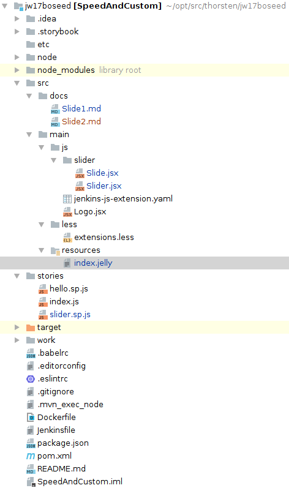
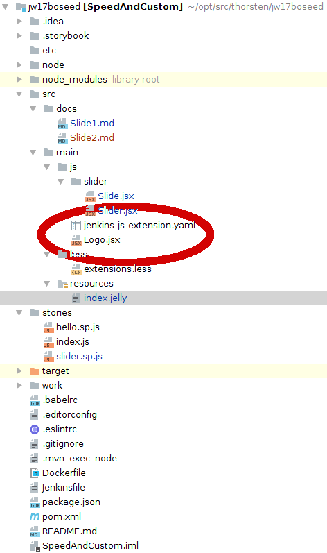
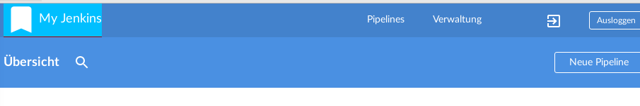

## Pimp my Blue Ocean

### create a custom plugin 

We will use [JenkinsWorld 2017 BO seed](https://github.com/scherler/jw17boseed)

### customize Blue Ocean
 - with custom css
 - custom components

## Plugin Anatomy
​


## How to Implement a Client-Side (JavaScript) Extension Point



1. `jenkins-js-extension.yaml` - Extension Point definition file. 
Needs to be placed in `src/main/js` (the root of your JavaScript source).   
1. The `.jsx` component file that implements the Extension Point.
Placed relative to `jenkins-js-extension.yaml`. The `.jsx` file contains a [React] component needs `export default class Logo extends Component`. 

## jenkins-js-extension.yaml

```yaml
#
# Extension point implementations in this plugin.
#
# This file tells Blue Ocean what Extension Point components are in this
# plugin + what extension points they implement.
##

extensions:
  - component: Logo
    extensionPoint: jenkins.header.logo
```


